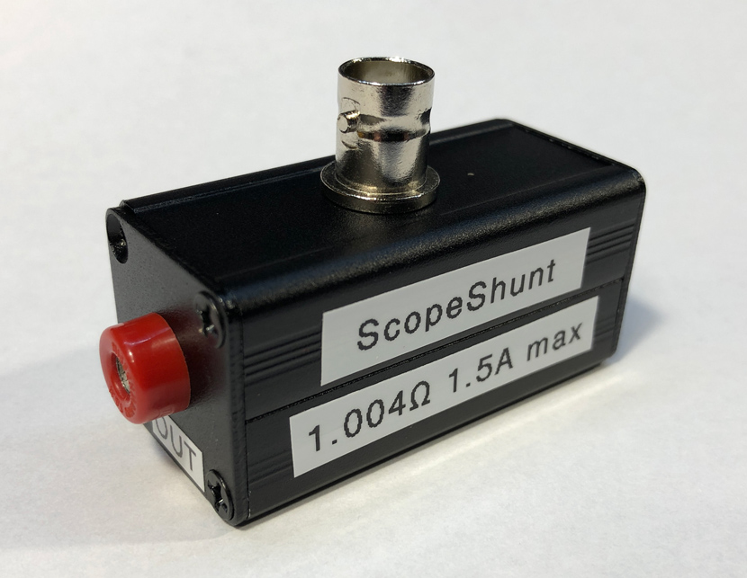

# ScopeShunt
We usually use an oscilloscope for visualizing a voltage over time but sometimes it’s also useful to visualize the current waveform over time. The right way to do it is to get a current probe which can sense the current and convert that to a voltage that the oscilloscope can display however such devices are pretty expensive, they can be around $1000 even for an entry level one like the Rigol RP1001C which is only rated up to 300KHz bandwidth.

The ScopeShunt is actually just a pack of resistors connected in parallel to form a shunt resistor which is assembled neatly inside an aluminium enclosure complete with easy to use 4mm banana and BNC connectors. It can be used to visualise the current waveform on any oscilloscope. More info about the ScopeShunt in [Voltlog #310](https://www.youtube.com/watch?v=wDC6eQ25UTQ).

